<div align="center">

# Fake Store ETL Pipeline

**A production-style Extract, Transform, Load (ETL) pipeline** that ingests data from the Fake Store API, applies data quality validation, and loads it into AWS RDS (PostgreSQL) and AWS S3 — orchestrated with Apache Airflow, deployed on AWS EC2, and automated with GitHub Actions CI/CD.

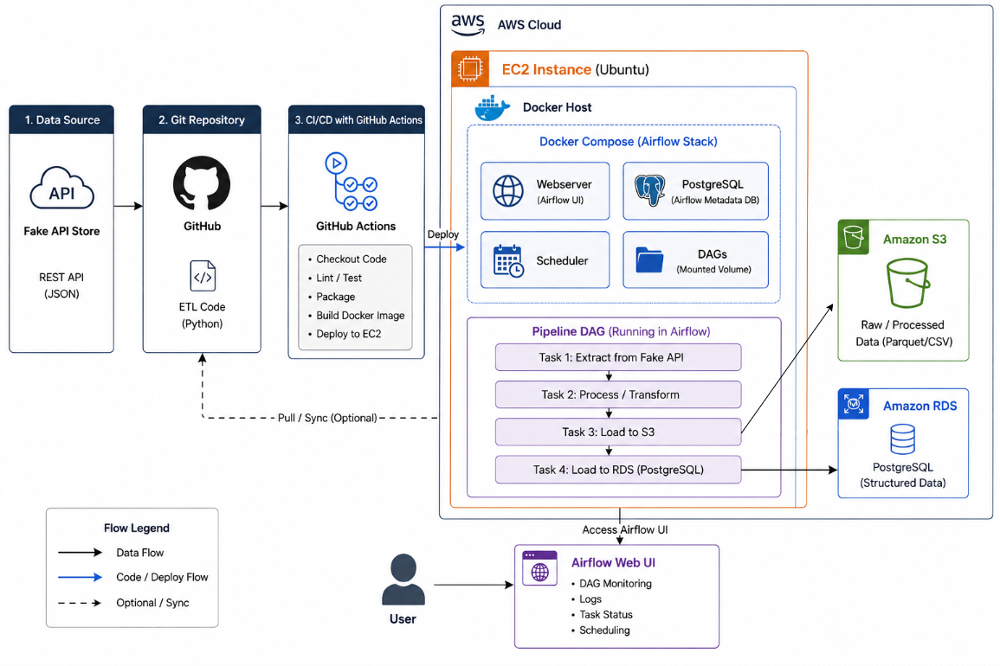

</div>

---

## Table of Contents

- [Project Overview](#project-overview)
- [Features](#features)
- [Tech Stack](#tech-stack)
- [Prerequisites](#prerequisites)
- [Installation & Setup](#installation--setup)
- [Configuration](#configuration)
- [Usage](#usage)
- [Pipeline Workflow](#pipeline-workflow)
- [Data Quality Checks](#data-quality-checks)
- [Database Schema](#database-schema)
- [AWS Infrastructure](#aws-infrastructure)
- [Orchestration with Apache Airflow](#orchestration-with-apache-airflow)
- [CI/CD with GitHub Actions](#cicd-with-github-actions)
- [Monitoring & Verification](#monitoring--verification)
- [Troubleshooting](#troubleshooting)
- [Roadmap](#roadmap)
- [Contributing](#contributing)
- [License](#license)

---

## Project Overview

This project demonstrates an end-to-end, cloud-native data engineering workflow built around these core principles:

- **Data Extraction** — Pulls product and user data from the Fake Store API
- **Data Transformation** — Cleans, normalizes, and restructures raw JSON into analytics-ready tables
- **Data Quality Assurance** — Validates data integrity before it is persisted
- **Multi-Target Loading** — Writes to PostgreSQL (OLAP) and S3 (data lake) simultaneously
- **Orchestration** — Fully automated and scheduled through Apache Airflow
- **Cloud Infrastructure** — Provisioned and run on AWS (EC2, RDS, S3)
- **CI/CD Automation** — GitHub Actions deploys DAGs to production on every push

It serves as both a **learning reference** for data engineering fundamentals and a **starter template** for production-grade pipelines.

---

## Features

| | |
|---|---|
| ✅ | Automated, end-to-end ETL orchestrated with Apache Airflow |
| ✅ | Robust error handling for API timeouts, DB connections, and validation failures |
| ✅ | Dedicated data quality framework enforced before every load |
| ✅ | Dual-destination loading — PostgreSQL for OLAP, S3 for the data lake |
| ✅ | Fully cloud-native deployment on AWS (EC2, RDS, S3) |
| ✅ | CI/CD automation via GitHub Actions |
| ✅ | Infrastructure as Code with Pulumi |
| ✅ | Built-in monitoring and pipeline verification utilities |
| ✅ | Structured, production-ready logging |

---

## Tech Stack

| Component | Technology |
|-----------|-----------|
| Language | Python 3.x |
| Data Processing | Pandas |
| Orchestration | Apache Airflow |
| Database | PostgreSQL (AWS RDS) |
| Data Lake | AWS S3 |
| Compute | AWS EC2 |
| Containerization | Docker |
| Infrastructure as Code | Pulumi (Python SDK) |
| CI/CD | GitHub Actions |
| ORM / Connection | SQLAlchemy |
| AWS SDK | Boto3 |
| API Client | Requests |
| DB Driver | psycopg2 |

---

## Prerequisites

**Local environment**
- Python 3.8+
- Git
- Docker
- `venv` (or equivalent virtual environment tool)

**AWS account**
- RDS PostgreSQL instance
- S3 bucket for the data lake
- EC2 instance for Airflow
- IAM user with programmatic access (Access Key ID & Secret Access Key)

**Required IAM permissions**
```
rds:*
s3:*
ec2:*
iam:*
```

**GitHub**
- A repository containing this codebase
- Repository secrets configured for AWS/EC2 credentials

---

## Installation & Setup

**1. Clone the repository**
```bash
git clone https://github.com/yourusername/fake-store-etl-pipeline.git
cd fake-store-etl-pipeline
```

**2. Create and activate a virtual environment**
```bash
python -m venv venv

# Windows
venv\Scripts\activate

# macOS/Linux
source venv/bin/activate
```

**3. Install dependencies**
```bash
pip install -r requirements.txt
```

**4. Create your environment file**
```bash
cp .env.example .env
```

**5. Configure environment variables** — see [Configuration](#configuration) below.

---

## Configuration

Set the following variables in your `.env` file:

| Variable | Description | Example |
|----------|-------------|---------|
| `API_URL` | Fake Store API base URL | `https://fakestoreapi.com` |
| `DB_HOST` | PostgreSQL RDS endpoint | `my-db.xxxxx.us-east-1.rds.amazonaws.com` |
| `DB_PORT` | PostgreSQL port | `5432` |
| `DB_NAME` | Database name | `etl_database` |
| `DB_USER` | Database username | `postgres` |
| `DB_PASSWORD` | Database password | `••••••••` |
| `S3_BUCKET_NAME` | S3 bucket name | `my-etl-bucket` |
| `AWS_REGION` | AWS region | `us-east-1` |
| `AWS_ACCESS_KEY_ID` | AWS access key | `AKIA••••••••` |
| `AWS_SECRET_ACCESS_KEY` | AWS secret key | `••••••••••••••••` |

**Airflow schedule** (`dags/etl_pipeline.py`):
```python
schedule_interval = '@daily'
start_date = datetime(2026, 1, 1)
catchup = False
```

---

## Usage

### Run locally
```bash
source venv/bin/activate      # or venv\Scripts\activate on Windows
python main.py
```
```
=== Starting Fake Store ETL Pipeline ===
[1/4] Extracting data from Fake Store API...
[2/4] Transforming extracted data...
[3/4] Performing Data Quality Checks...
[4/4] Loading clean data into PostgreSQL database...
=== ETL Pipeline Completed Successfully! ===
```

### Verify the database
```bash
python check_db.py
```

### Run under Apache Airflow (production)
```bash
airflow db init

airflow users create \
    --username admin --password admin \
    --firstname Admin --lastname User \
    --role Admin --email admin@example.com

airflow webserver --port 8080
airflow scheduler
```
Access the Airflow UI at `http://<your-ec2-ip>:8080`.

---

## Pipeline Workflow

**1. Extract**
- `extract_products()` — pulls data from the `/products` endpoint
- `extract_users()` — pulls data from the `/users` endpoint

**2. Transform**
- *Products:* parses the nested rating object, renames columns for clarity, casts types, selects relevant fields
- *Users:* extracts nested name and address fields, standardizes phone numbers, capitalizes names, renames columns

**3. Validate**
- Runs the full data quality suite (see below) — the pipeline halts on any failure

**4. Load**
- Writes `dim_products` and `dim_users` to PostgreSQL
- Uploads `products.csv` and `users.csv` to the S3 data lake under `processed/`

<div align="center">

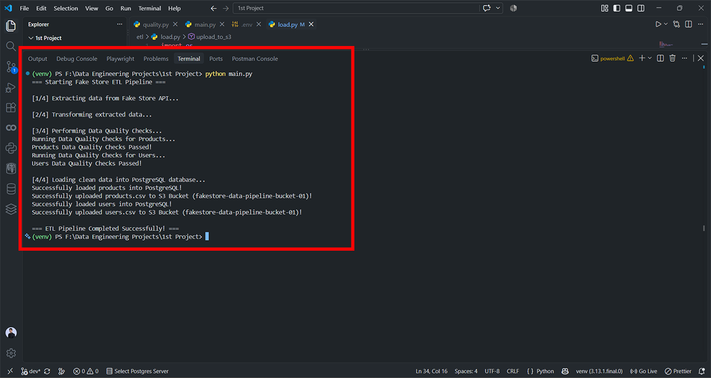
*A completed, successful end-to-end pipeline run*

</div>

---

## Data Quality Checks

**Products**
- DataFrame is not empty
- No null values in `product_id` (primary key)
- No duplicate `product_id` values
- All prices are greater than 0

**Users**
- DataFrame is not empty
- No null values in `user_id` (primary key)
- No duplicate `user_id` values
- Every user has an email address

Any failed check raises a `ValueError`, which halts the pipeline before data is loaded:
```
ValueError: Data Quality Error: Duplicate 'product_id' values found!
```

---

## Database Schema

**`dim_products`**
```sql
CREATE TABLE dim_products (
    product_id INTEGER PRIMARY KEY,
    product_name VARCHAR(255),
    product_price FLOAT,
    product_category VARCHAR(100),
    product_description TEXT,
    rating_rate FLOAT,
    rating_count INTEGER
);
```

**`dim_users`**
```sql
CREATE TABLE dim_users (
    user_id INTEGER PRIMARY KEY,
    full_name VARCHAR(255),
    first_name VARCHAR(100),
    last_name VARCHAR(100),
    user_email VARCHAR(255) NOT NULL,
    user_username VARCHAR(100),
    user_phone VARCHAR(20),
    street VARCHAR(255),
    city VARCHAR(100)
);
```

<div align="center">

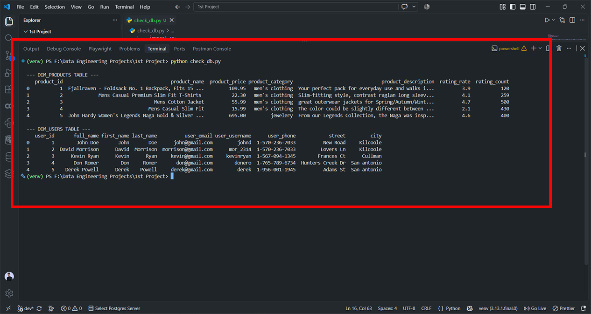
*Verifying table contents with `check_db.py`*

</div>

---

## AWS Infrastructure

| Resource | Purpose |
|----------|---------|
| **EC2** | Hosts the Airflow webserver and scheduler |
| **RDS (PostgreSQL)** | Stores `dim_products` and `dim_users` |
| **S3** | Data lake for processed CSV output |
| **Security Groups** | Control inbound access to Airflow (8080) and PostgreSQL (5432) |

<table>
<tr>
<td width="50%">

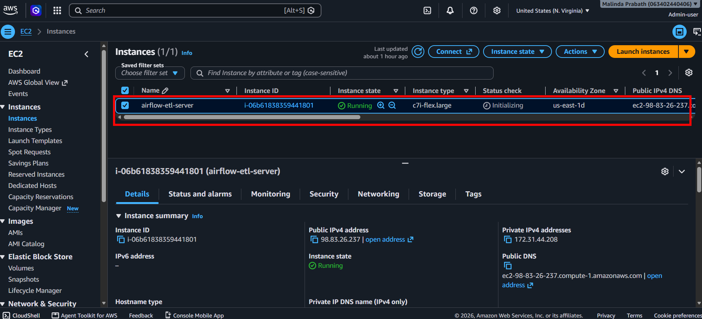
*EC2 instance running Airflow*

</td>
<td width="50%">

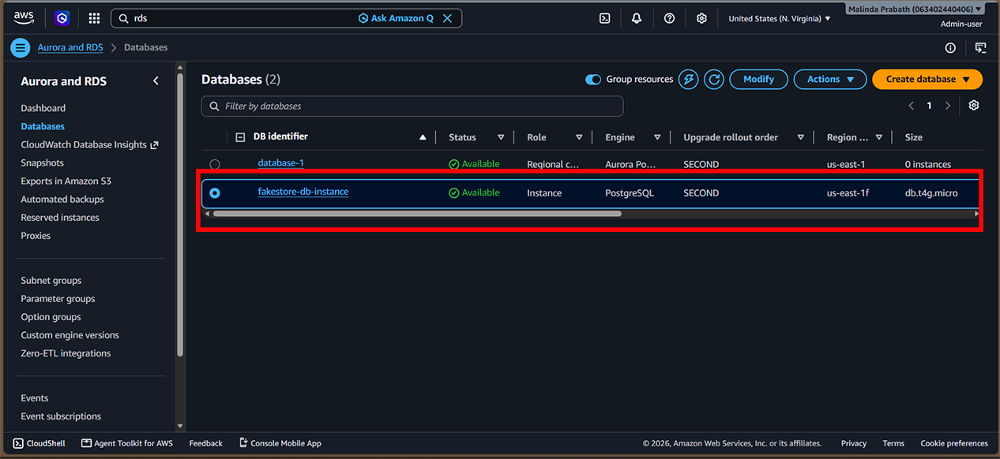
*RDS PostgreSQL instance*

</td>
</tr>
<tr>
<td width="50%">

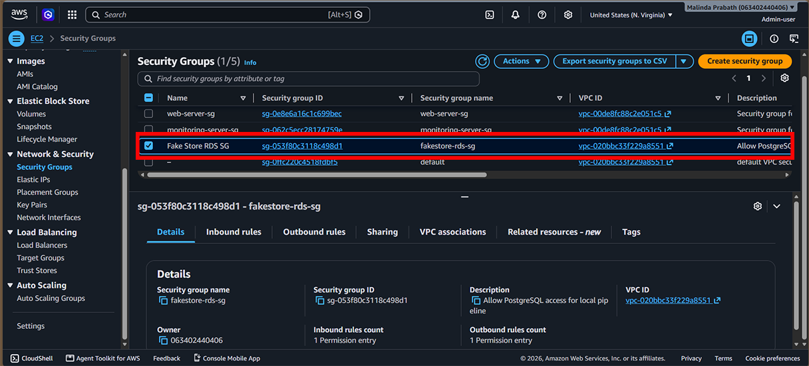
*Security group inbound rules*

</td>
<td width="50%">

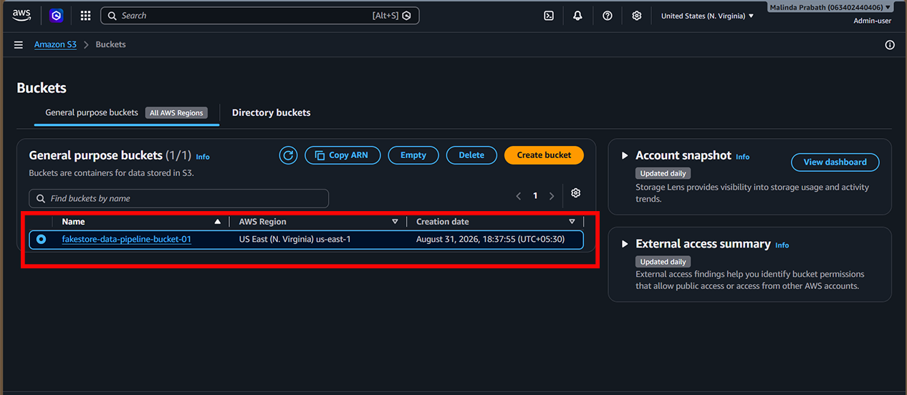
*S3 bucket used as the data lake*

</td>
</tr>
</table>

**S3 bucket contents**

<table>
<tr>
<td width="50%">

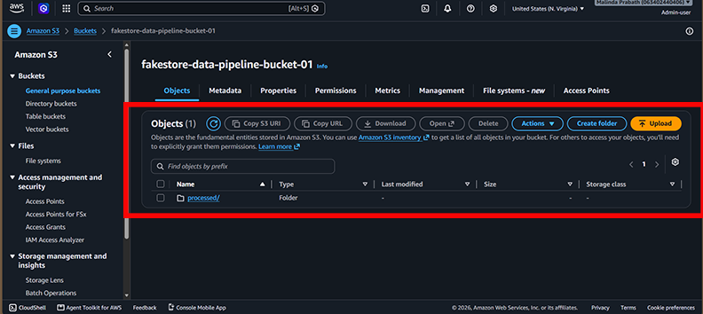

</td>
<td width="50%">

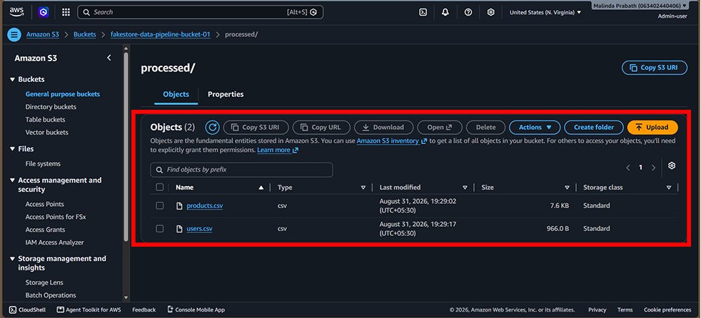

</td>
</tr>
</table>

**Container deployment**

<div align="center">

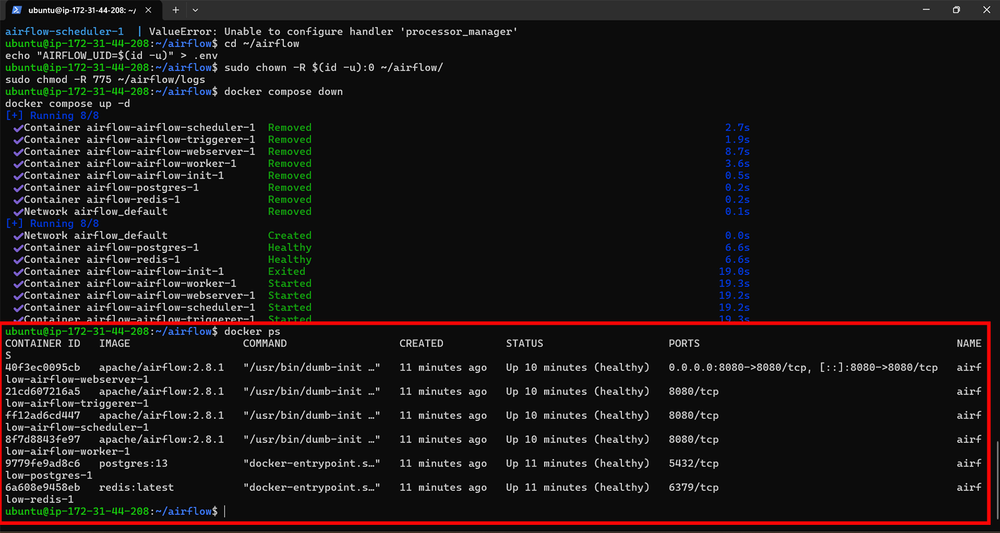
*Airflow webserver and scheduler running as Docker containers on EC2*

</div>

---

## Orchestration with Apache Airflow

The pipeline runs as a single DAG (`etl_pipeline`) with three sequential tasks: `extract_data → transform_data → load_data`, scheduled to run daily.

<table>
<tr>
<td width="33%">

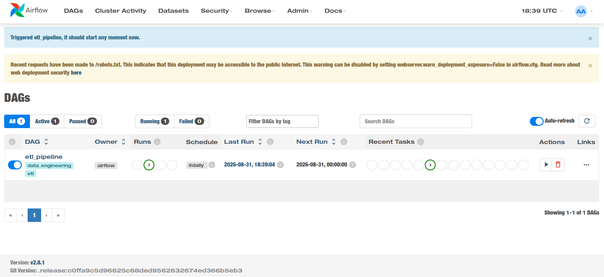
*DAG overview*

</td>
<td width="33%">

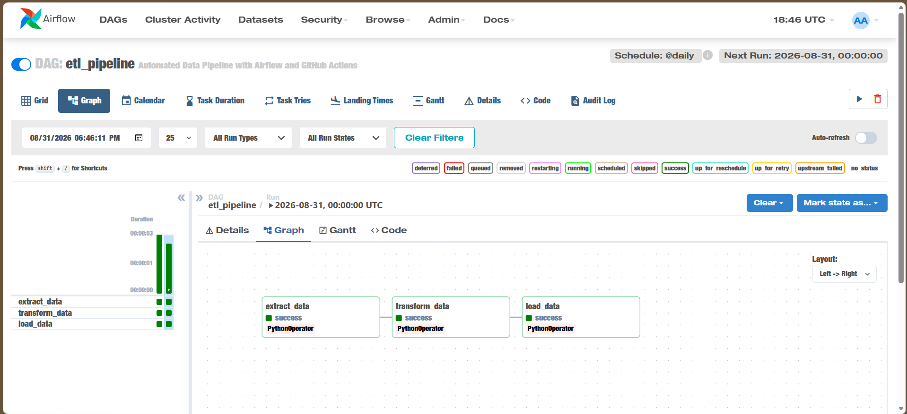
*Task dependency graph*

</td>
<td width="33%">

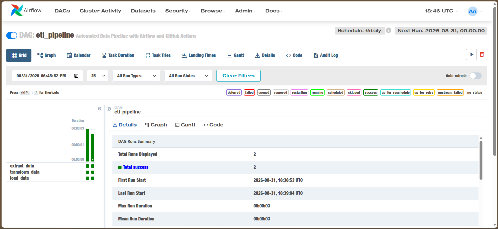
*Run history grid view*

</td>
</tr>
</table>

---

## CI/CD with GitHub Actions

Every push to `main` automatically deploys the latest DAGs to the EC2 instance via SCP and triggers a reload.

**Workflow:** `.github/workflows/deploy_dags.yml`
```yaml
Jobs:
  1. Checkout code
  2. Deploy DAGs to EC2 via SCP
     - Copies dags/* to ~/airflow/dags
     - Triggers Airflow DAG reload
```

**Required repository secrets**

| Secret | Description |
|--------|-------------|
| `EC2_HOST` | Public IP or DNS of the EC2 instance |
| `EC2_USERNAME` | SSH username (`ec2-user` or `ubuntu`) |
| `EC2_SSH_KEY` | Private SSH key (PEM format) |

<table>
<tr>
<td width="50%">

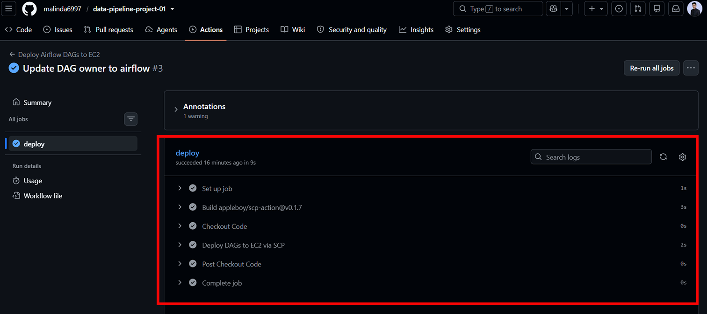
*Deployment workflow in action*

</td>
<td width="50%">

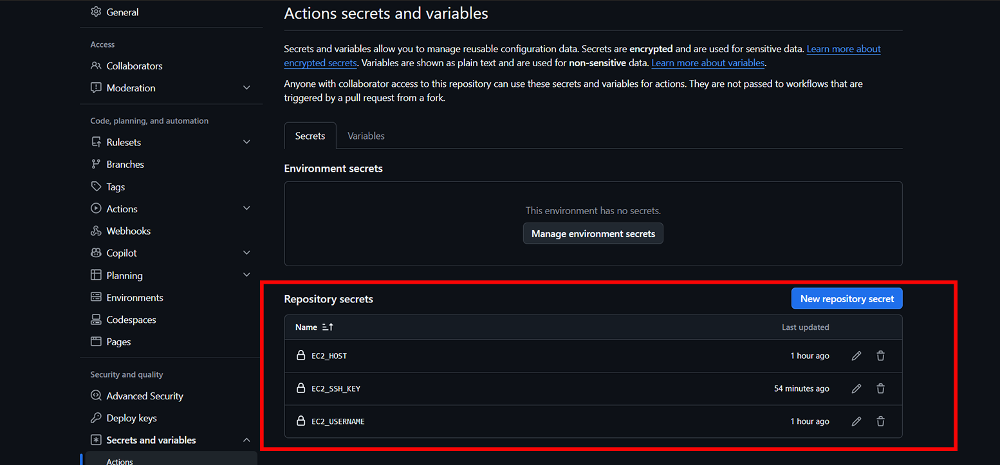
*Repository secrets configuration*

</td>
</tr>
</table>

---

## Monitoring & Verification

**Database performance** — RDS CloudWatch metrics captured during and after pipeline runs:

<table>
<tr>
<td width="33%">

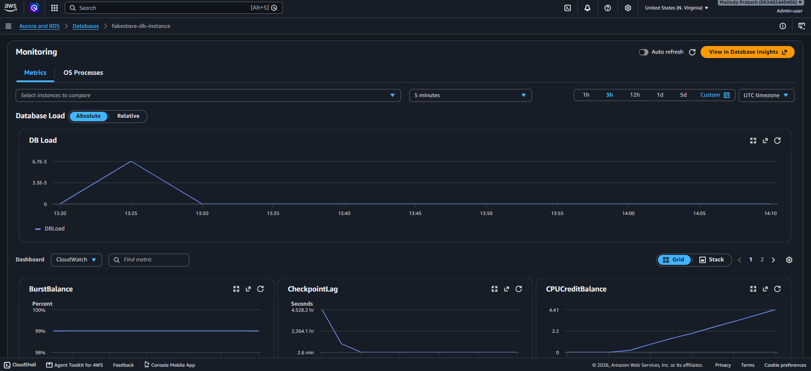
*CPU utilization*

</td>
<td width="33%">

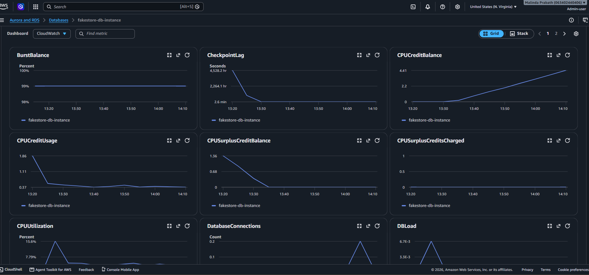
*Network throughput & connections*

</td>
<td width="33%">

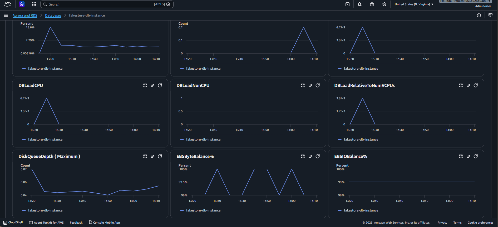
*Storage & IOPS*

</td>
</tr>
</table>

**Querying results directly**
```python
import pandas as pd
from sqlalchemy import create_engine
from dotenv import load_dotenv
import os

load_dotenv()
engine = create_engine(
    f"postgresql://{os.getenv('DB_USER')}:{os.getenv('DB_PASSWORD')}"
    f"@{os.getenv('DB_HOST')}:{os.getenv('DB_PORT')}/{os.getenv('DB_NAME')}"
)

products = pd.read_sql(
    "SELECT * FROM dim_products ORDER BY rating_rate DESC LIMIT 10;", engine
)

users_by_city = pd.read_sql(
    "SELECT city, COUNT(*) AS user_count FROM dim_users GROUP BY city;", engine
)
```

---

## Troubleshooting

**API connection error**
```bash
ping fakestoreapi.com
curl https://fakestoreapi.com/products
grep API_URL .env
```
If timeouts persist, increase `timeout=10` to a higher value in `extract.py`.

**PostgreSQL connection failed**
```bash
psql -h <rds-endpoint> -U postgres -d postgres
cat .env | grep DB_
```
Confirm the RDS instance is `Available` and that the security group allows inbound traffic on port `5432`.

**S3 upload fails**
```bash
grep AWS_ .env
aws s3 ls s3://<your-bucket-name>/
```
Confirm the IAM user has S3 permissions and the bucket/region match your `.env`.

**Data quality check fails**
```bash
curl https://fakestoreapi.com/products | jq '.[] | .id' | sort | uniq -d
```
Inspect `transform.py` for column-mapping issues, then re-run `python main.py`.

**DAG not visible in Airflow**
```bash
ls -la ~/airflow/dags/
python ~/airflow/dags/etl_pipeline.py   # check for syntax errors
airflow scheduler restart
tail -f ~/airflow/logs/etl_pipeline/
```

---

## Roadmap

- [ ] Data lineage tracking (OpenLineage / Marquez)
- [ ] Incremental loading (CDC)
- [ ] Data profiling and statistics
- [ ] Schema validation with Great Expectations
- [ ] Slack notifications on failure
- [ ] Data quality dashboards (Grafana / Tableau)
- [ ] Date-based partitioning in S3
- [ ] S3 Intelligent-Tiering for cost optimization
- [ ] Spark-based processing for larger workloads
- [ ] API rate limiting and caching

---

## Contributing

1. Fork the repository
2. Create a feature branch: `git checkout -b feature/amazing-feature`
3. Commit your changes: `git commit -m 'Add amazing feature'`
4. Push the branch: `git push origin feature/amazing-feature`
5. Open a Pull Request

**Coding standards:** follow PEP 8, add docstrings to all functions, handle edge cases explicitly, test locally before pushing, and update this README for any user-facing changes.

---

## License

This project is licensed under the MIT License. See the `LICENSE` file for details.

<div align="center">

**Last Updated:** September 2026 &nbsp;|&nbsp; **Version:** 1.0.0

</div>
